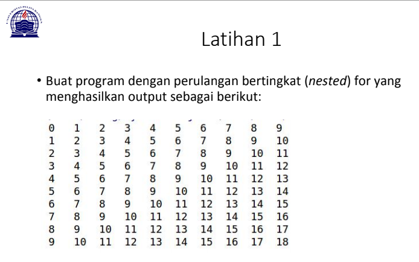
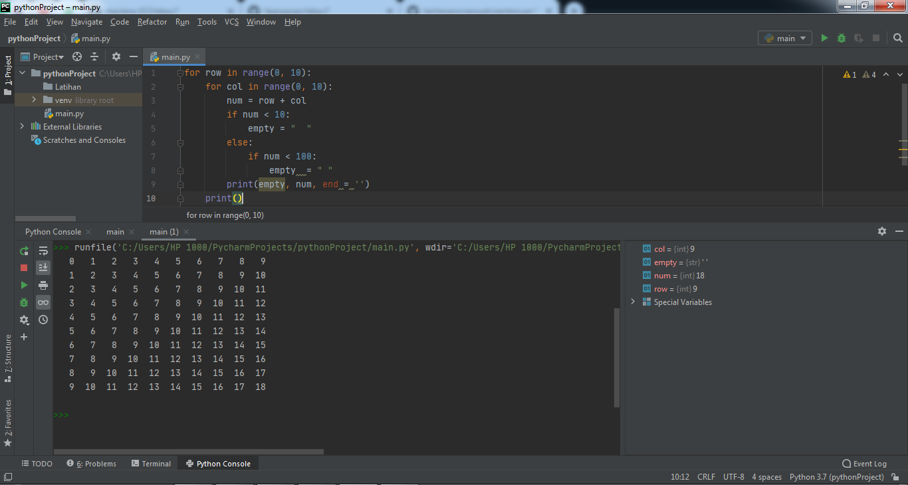
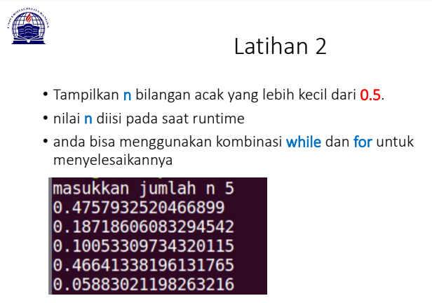
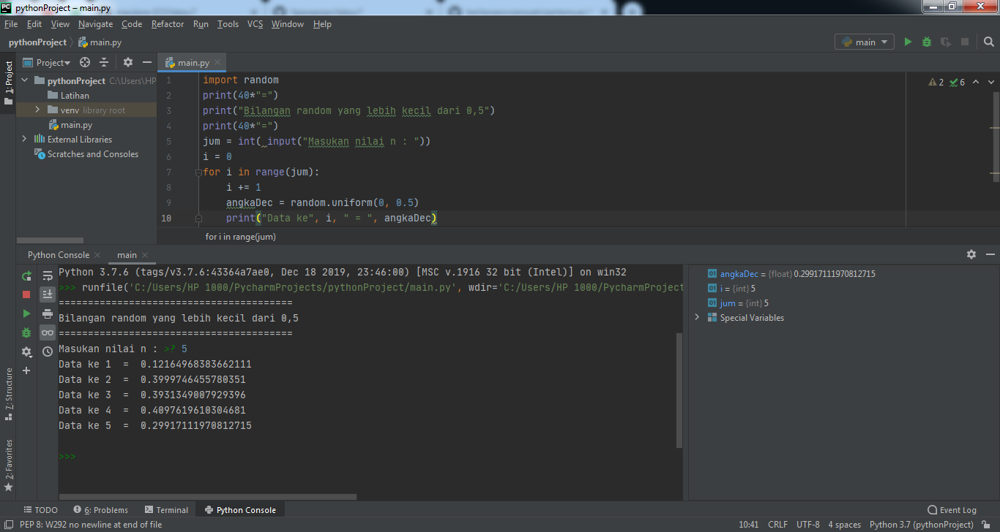
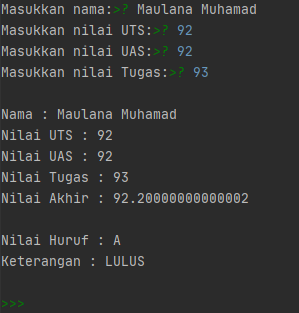
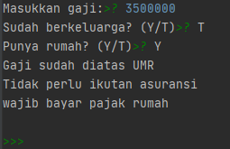

## Tugas 
Repository ini dibuat untuk memenuhi tugas Pertemuan 7 - Bahasa Pemrograman.
<hr>
Nama    : Maulana Muhamad

NIM     : 312010188

Kelas   : TI.20. A.1
<hr>

# Modul Pratikum 1 
## Latihan 1



```python
for row in range(0, 10):
    for col in range(0, 10):
        num = row + col
        if num < 10:
            empty = "  "
        else:
            if num < 100:
                empty  = " "
        print(empty, num, end = '')
    print()
```

setelah syntax diatas di run, maka hasilnya sperti gambar dibawah ini :



## Latihan 2



```python
    import random
    print(40*"=")
    print("Bilangan random yang lebih kecil dari 0,5")
    print(40*"=")
    jum = int( input("Masukan nilai n : "))
    i = 0
    for i in range(jum):
        i += 1
        angkaDec = random.uniform(0, 0.5)
        print("Data ke", i, " = ", angkaDec)
```

setelah syntax diatas di run, maka hasilnya sperti gambar dibawah ini :



### Penjelasan:

>syntax dibawah untuk mencari random <br>
```python 
import random
```

>dibawah ini untuk menuntukan jumblah input <br>
```python
jum = int(input("masukan nilai n : "))
```

>dibawah ini untuk menampilkan urutan sesuai data jumlah data inputan <br>
```python
angkaDec = random.uniform(0, 0.5)
    print("Data ke", i, " = ", angkaDec)
```

# Modul Pratikum 2
## Latihan 1
### Membuat program menentukan nilai akhir
<hr>

```python
nama = input("Masukkan nama:")
uts = input("Masukkan nilai UTS:")
uas = input("Masukkan nilai UAS:")
tugas = input("Masukkan nilai Tugas:")
akhir = (int(tugas) * .2) + (int(uts) * .4) + (int(uas) * .4)
keterangan = ("TIDAK LULUS", "LULUS")[akhir > 60.0]
if akhir > 80:
 huruf = "A"
elif akhir > 70:
 huruf = "B"
elif akhir > 50:
 huruf = "C"
elif akhir > 40:
 huruf = "D"
else:
 huruf = "E"

print("\nNama :",nama)
print("Nilai UTS :",uts)
print("Nilai UAS :",uas)
print("Nilai Tugas :",tugas)
print("Nilai Akhir :",akhir)
print("\nNilai Huruf :",huruf)
print("Keterangan :",keterangan)
```

setelah di run, maka hasilnya seperti dibawah ini:



### Penjelasan :

>Masukkan nilai yang sudah di tentukan oleh variabel seperti "nama, uts, uas,tugas"

```python
untuk, akhir = (int(tugas) * .2) + (int(uts) * .4) + (int(uts) * .4)
```
```python
if akhir > 80: Jika nilai akhir diatas 80, maka huruf = 'A'
```
```python
elif akhir > 70: dan jika nilai akhir diatas 70, maka huruf = 'B'
```
```python
elif akhir > 50: dan jika nilai akhir diatas 50, maka huruf = 'C'
```
```python
elif akhir > 40: dan jika nilai akhir diatas 40, maka huruf = 'D'
```
```python
else: selain itu maka huruf = 'E'
```
```python
cetak nilai akhir print
```

## Latihan 2
### Membuat program menampilkan status gaji karyawan
<hr>

```python
gaji = int(input("Masukkan gaji:"))
berkeluarga = (False, True)[input("Sudah berkeluarga? (Y/T)") == "Y"]
punya_rumah = (False, True)[input("Punya rumah? (Y/T)") == "Y"]

if gaji > 3000000:
 print ("Gaji sudah diatas UMR")
 if berkeluarga:
 print ("Wajib ikutan asuransi dan menabung untuk pensiun")
 else:
 print ("Tidak perlu ikutan asuransi")

 if punya_rumah:
 print ("wajib bayar pajak rumah")
 else:
 print ("tidak wajib bayar pajak rumah")
else:
 print ("Gaji belum UMR")
```
setelah di run, maka hasilnya seperti dibawah ini:



### Penjelasan :

```python
gaji = int(input("Masukkan gaji:")) masukkan jumlah gaji.
if gaji > 3000000: jika gaji diatas 3jt, maka print ("Gaji sudah diatas UMR") jika tidak, maka else: print("Gaji belum UMR") dan juga pengkondisian yang lainnya.
maka data akan di cetak sesuai data yang di isi.
```